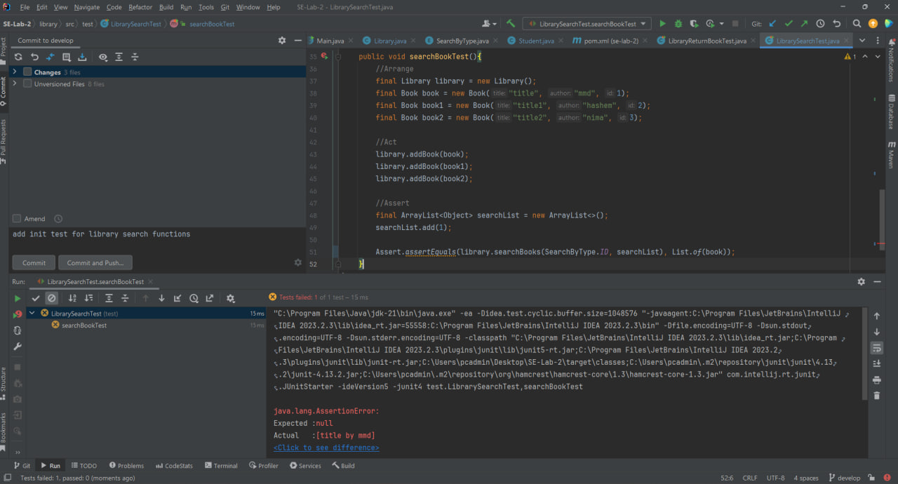
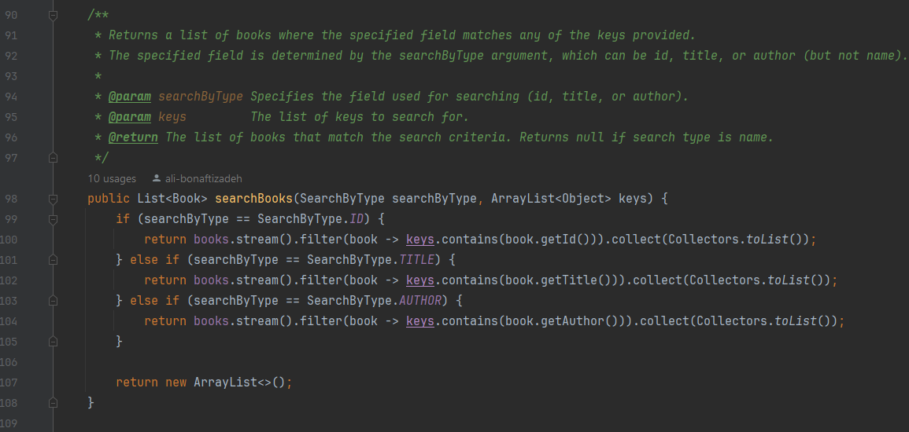
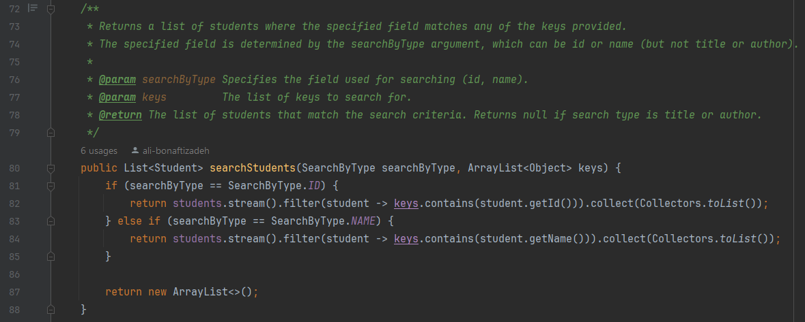
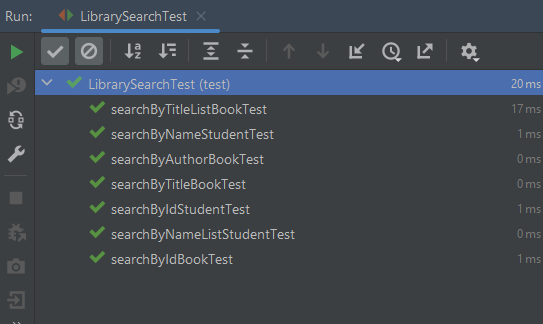
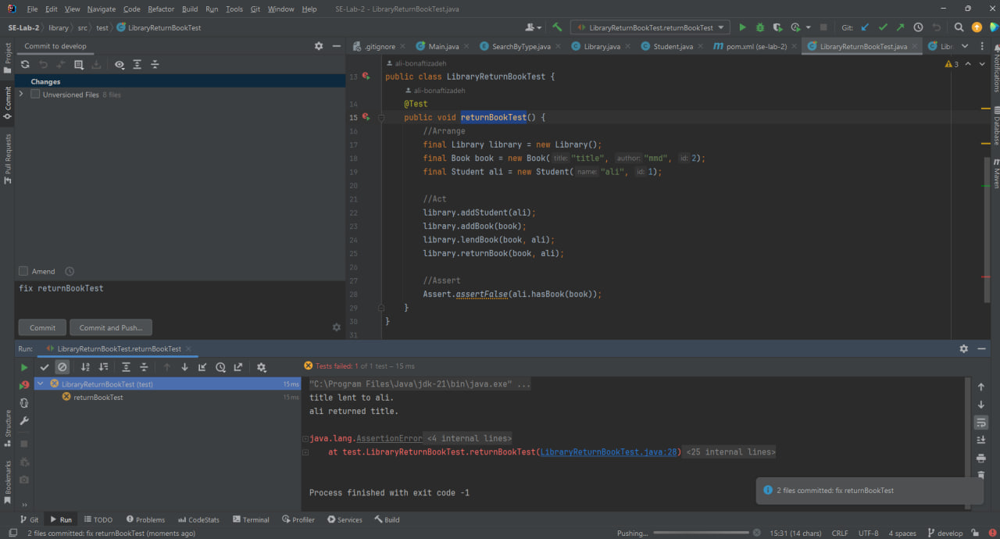
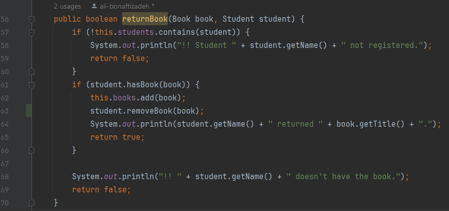
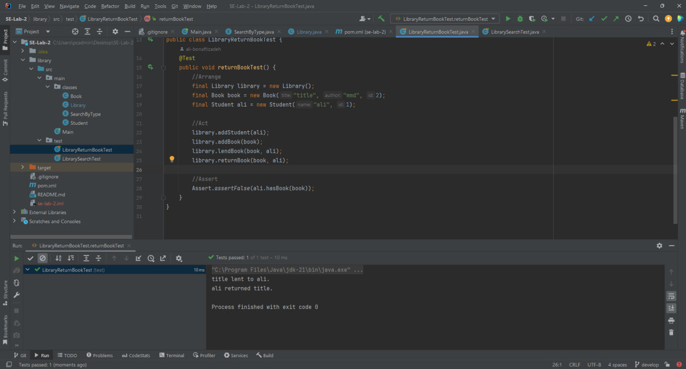

# SE-Lab-2

## گزارش آزمایش دوم

در این آزمایش، قصد داریم به برنامه‌ی library یک سری قابلیت اضافه کنیم و این پیاده سازی را به روش TDD انجام دهیم.

ابتدا برای نیازمندی های مدنظر، یونیت تست می‌نویسیم و برنامه را ران می‌کنیم تا مطمئن شویم تست ها fail می‌شوند.

سپس پیاده سازی تابع جستجوی کتاب  و جستجوی دانشجو داخل کتابخانه را انجام می‌دهیم.

و حال مجدد تست‌های نوشته شده را ران می‌کنیم تا از عملکرد برنامه مطمئن شویم

با پاس شدن تمامی تست ها، از صحت عملکرد برنامه مطمئن می‌شویم.

حال برای باگی که درون کتابخانه مشاهده شد، تست می‌نویسیم و سپس آن را دیباگ می‌کنیم.

## پرسشها

1. روش TDD را با روش تست کردن سنتی که در آن بعد از نوشتن برنامه، تست‌ها نوشته می‌شوند، از نظر نوع پروژه‌هایی که هر یک برای آن‌ها مناسب هست، مقایسه کنید.

روش TDD برای پروژه‌های زیر مناسب است:
- پروژه‌های چابک: این روش به این دلیل مناسب است چرا که مدام فیدبک به ما داده می‌شود و بصورت مداوم و چرخه‌ای کار را جلو می‌بریم و این به توسعه دهنده ها این قابلیت را می‌دهد که در برابر نیازمندی‌ها کدشان را validate کنند و تضمین می‌کند تا بصورت افزایشی functionality به درستی باشد.
- سامانه‌های پیچیده: این روش برای پروژه‌هایی مناسب است که تغییر یک بخش ممکن است عواقب غیر قابل پیش بینی داشته باشد. به همین دلیل تستها را قبل کد مینویسیم تا اگر یک بخش را تغییر دادیم functionality به هم نریزد و کد مطابق انتظار کار کند.

روش تست سنتی برای پروژه‌های زیر مناسب است:
- پروژه‌های آبشاری و sequential: پروژه‌هایی که نیازمندی آنها از اول مشخص است و مسیر خطی برای توسعه طی می‌کنند.
- نگهداری سامانه‌های قدیمی: این سامانه‌ها چون از قبل طراحی شدند و نیازمندی‌خایشان تقریبا مشخص است در محدوده TDD نیست و باید برای یک پروژه آماده تست بنویسیم که بگر تغییری دادیم نیازمندی‌ها با مشکل مواجه نشوند و کد به درستی کار کند.

2. در فرایند ایجاد نرم‌افزار هم تیم ایجاد (Development Team) و هم تیم تضمین کیفیت (QA Team) وظیفه تست نرم‌افزار را برعهده دارند. هر کدام از این تیم‌ها بیش‌تر با کدام دسته از انواع تست سروکار دارد؟ چرا؟ انواع تست ذکر شده را به طور مختصر شرح دهید.

تستهای تیم ایجاد:
- تست unit test: برای اطمبنان از کارکرد یک تابع بصورت ایزوله.
- تست integrstion test: تست بخشها و component های مختلف باهم.
- تست component test: مشابه integration test ولی در سطوح کلاسها ماژولها و سرویسها بصورت ایزوله.
- تست mock test: ایجاد اشیای mock برای شبیه سازی وابستگیهایی که براحتی قابل تست نیستند مثل دیتابیس و سرویسهای خارجی و ... .

تستهای تیم تضمین کیفیت:
- تست funtional test: تیم تضمین کیفیت از آن به منظور اطمینان از درستی رفتار نرم افزار از دید کاربر نهایی استفاده می‌کند.
- تست regression test: اطمینان از اینکه تغییرات جدید روی نرم افزار موجب خرابی نرم افزار نشود.
- تست user interface (UI): به منظور شبیه سازی تعامل کاربر با عناصر موجود در اپلیکیشن استفاده می‌شود تا تجریه کاربر از GUI را بسنجند.
- تست performance test: اطمینان از اینکه مشخصه‌های عملکردی مثل responsiveness و scalability و استفاده از منابع در شرایط مختلف به درستی انجام شوند و bottleneck ها شناسایی شوند.
- تست security test: برای شناسایی تهدیدها و ضعفهای امنیتی و نفوذپذیری نرم افزار استفاده می‌شود تا میزان ریسک را کاهش دهند.
